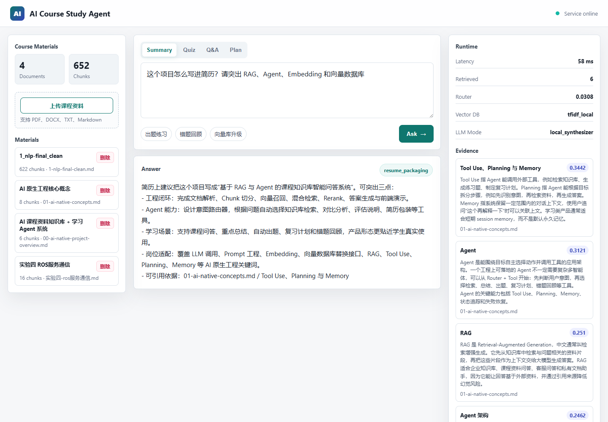

# AI Course Study Agent

面向大学课程复习场景的 **RAG + Learning Agent** 系统。用户上传课件、笔记、实验报告后，系统会构建课程资料知识库，并支持资料问答、知识点总结、自动出题、复习计划、错题回顾和简历化项目分析。

这个项目的目标不是做一个泛泛的聊天机器人，而是做一个能解释“AI 原生应用如何落地”的完整 demo：文档解析、Chunk 切分、向量数据库、混合检索、Rerank、Evidence Guard、LLM 生成、Agent Router、Tool Use、Memory 和前端可视化都在一条链路里。



## 适配

关键词：

- AI 应用产品设计与开发
- RAG 知识库系统搭建
- Embedding 与向量数据库
- Prompt Engineering 与 LLM 调用
- Agent 架构、Tool Use、Planning、Memory
- 前后端工程交付与可视化演示
- 问答评估、引用追踪与幻觉控制

## 核心功能

- **资料上传与解析**：支持 Markdown、TXT、PDF、DOCX，上传后统一转为 Markdown 入库。
- **文档切分**：按章节和段落切成 chunk，保留 title、section、source 等 metadata。
- **向量数据库**：支持 Chroma 持久化向量库；未安装 Chroma 时自动 fallback 到 TF-IDF 本地向量检索。
- **混合检索**：融合向量相似度、关键词覆盖、标题/章节命中，提升课程资料召回准确性。
- **Rerank**：对候选 chunk 二次排序，优先展示高相关证据。
- **Evidence Guard**：低证据问题不强行回答，提示资料缺口，降低幻觉风险。
- **Agent Router**：自动识别问答、总结、出题、概念解释、复习计划、错题回顾、项目包装等意图。
- **Tool Trace**：前端展示每次回答的工具调用链路、耗时、召回分数和运行模式。
- **Session Memory**：保留最近对话上下文，支持追问。
- **LLM Adapter**：预留 OpenAI-compatible 接口，可接入 OpenAI、DeepSeek、Qwen、混元等模型。

## 技术架构

```text
User Query
   ↓
Intent Router
   ↓
Tool Planner
   ├─ hybrid_retrieval
   ├─ rerank
   ├─ summarize_tool
   ├─ generate_quiz
   ├─ explain_concept
   ├─ make_review_plan
   └─ mistake_review
   ↓
Answer Synthesizer
   ↓
Citation + Runtime Metrics + Agent Trace
```

## 技术栈

- Backend：Python、FastAPI、Pydantic、Uvicorn
- Retrieval：Chroma、Scikit-learn、TF-IDF、HashingVectorizer、Hybrid Search
- RAG：Chunking、Top-K Retrieval、Rerank、Citation、Evidence Guard
- Agent：Intent Router、Tool Use、Session Memory、Lightweight Planning
- LLM：OpenAI-compatible Chat API Adapter
- Frontend：HTML、CSS、JavaScript
- Documents：pypdf、python-docx

## 快速运行

```powershell
cd D:\ai-native-knowledge-agent
python -m pip install -r requirements.txt
python -m uvicorn app.main:app --host 127.0.0.1 --port 8015 --reload
```

打开：

```text
http://127.0.0.1:8015
```

## 向量数据库配置

默认使用 `AI_AGENT_VECTOR_BACKEND=auto`：

- 如果安装了 `chromadb`，系统会使用 `chroma_hashing` 后端，并将向量索引持久化到 `data/vector_store/`。
- 如果当前环境没有安装 Chroma，系统会自动回退到 `tfidf_local`，保证 demo 可以直接运行。

也可以手动指定：

```powershell
$env:AI_AGENT_VECTOR_BACKEND="chroma"
```

或使用轻量本地模式：

```powershell
$env:AI_AGENT_VECTOR_BACKEND="tfidf"
```

## 可选 LLM 接入

系统没有 API Key 也能运行，会使用本地 synthesizer 生成结构化答案。需要接入真实大模型时，配置 OpenAI-compatible API：

```powershell
$env:AI_AGENT_LLM_BASE_URL="https://api.openai.com/v1"
$env:AI_AGENT_LLM_API_KEY="your_key"
$env:AI_AGENT_LLM_MODEL="gpt-4o-mini"
```

也可以替换为 DeepSeek、Qwen、混元等兼容接口。

## API

```http
GET  /api/health
GET  /api/kb/stats
GET  /api/kb/documents
POST /api/kb/upload
DELETE /api/kb/documents/{doc_id}
POST /api/ask
```

`/api/ask` 返回内容包括：

- `answer`：最终答案
- `intent`：路由识别结果
- `citations`：引用片段与分数
- `trace`：Agent 工具调用链路
- `metrics`：延迟、召回数、向量库后端、LLM 模式

## 简历写法

> 面向大学课程复习场景，设计并实现 AI 课程资料知识库 + 学习 Agent 系统，支持 PDF/DOCX/TXT/Markdown 资料上传、文档切分、Chroma/TF-IDF 向量检索、混合召回、Rerank、RAG 问答、引用追踪和低证据保护；采用 Router + Tool 的轻量 Agent 架构，根据用户意图自动调用总结、出题、概念解释、复习计划、错题回顾等工具，并在前端展示 Agent Trace、召回分数、响应延迟和 LLM 模式，提升学习问答的可信度与可解释性。

## 后续优化

- 将 Hashing/TF-IDF embedding 替换为 bge-small-zh、bge-base-zh 或 OpenAI embedding。
- 引入 Cross-Encoder / LLM Rerank。
- 增加 OCR、公式解析和版面结构恢复能力。
- 建立问答评估集，统计 Top-K 命中率、MRR、引用覆盖率和低证据拦截率。
- 将错题本持久化为结构化表，记录错题、知识点、来源 chunk 和复习计划。
- 使用 Docker Compose 部署前端、后端、向量数据库和模型网关。
