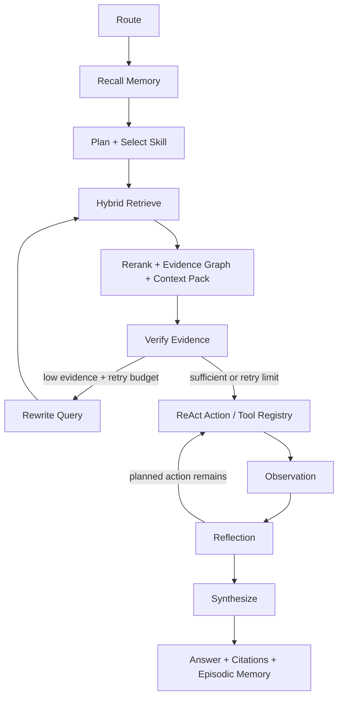

# Agent Workflow Architecture

## 设计目标

项目把 Agent 从一段顺序 `if/else` 调用升级为可观察、可验证、可暂停恢复的工作流。核心约束是：每个节点只做一类动作；是否重试由证据验证节点决定；任何循环都有明确预算；最终响应保留完整路径、节点事件与停止原因。

## State Graph

`AgentState` 在节点之间传递原始问题、当前检索查询、意图、Skill、Plan、Memory hits、packed context、Tool Observation、Reflection、尝试次数、证据质量、答案和停止原因。`StateGraph` 同时限制 retrieval、ReAct step 和全局 transition，防止错误路由造成无界循环。

## Context Engine

Document ID 由稳定文件身份生成，Chunk ID 由 `doc_id + section + normalized content` 生成，因此在前面插入无关章节不会让所有 chunk identity 漂移。重新加载时按内容身份复用未变化向量；删除文档时先移动到 `.trash` tombstone 并重建增量索引，API 支持恢复。

检索链为 `Dense + exact terms → rerank → bounded link expansion → context pack`。Evidence Graph 当前解析 `[[WikiLink]]` 关系；Context Packer 按来源优先级、去重、单来源上限和 mixed-language token 估算，在 `AI_AGENT_CONTEXT_TOKEN_BUDGET` 内选择上下文，并暴露 dropped chunks、source count 与 relation。

## Memory and Skill Execution

- Working Memory：当前任务、Graph Path、最后 Observation 与 Stop Reason。
- Episodic Memory：已完成/失败运行、来源与停止原因。
- Semantic Memory：知识文档的稳定摘要；直接结论仍必须由本次 KB evidence 支撑。
- Procedural Memory：Skill instructions、allowed tools 和 evaluation oracle。

长期记忆召回分数由 relevance、recency、task match、importance 组成，响应暴露每个分量。Skill 选择后，ReAct 按计划逐个调用 Tool Registry；Reflection 根据剩余动作、失败和审批状态决定 continue / accept / stop。

Tool Registry 对 Native 与 MCP 使用同一执行协议。MCP 客户端执行 Streamable HTTP initialize、initialized notification 与 `tools/call`。写/破坏性工具必须审批；相同 idempotency key 复用第一次完成结果，可回滚工具登记补偿回调。

## Breakpoint and Checkpoint

调试运行可以在任意节点执行前设置断点。`StateGraph.run` 返回 `paused`、待执行节点、历史路径和节点事件；服务端用内存 Checkpoint 保存 `AgentState`，恢复时跳过当前断点一次并继续执行。暂停期间有三种操作：

- Resume：保留当前状态继续，循环再次经过同一节点时仍会命中断点。
- Edit and Restart：替换问题并从 Route 重新计算，避免把旧意图或旧证据带入新问题。
- Cancel：清理 Checkpoint，不写入 Episodic Memory。

前端 SVG 执行图根据 `graph_events` 区分 completed、warning、retry、failed 和 paused，并将工具事件按实际顺序展开。

普通 `/api/ask` 返回完整结果；`/api/ask/stream` 在后台线程运行同一 State Graph，并通过 SSE event sink 在每个节点完成、失败或暂停时立即推送 `graph_event`，最后推送 `final`。这里选择 SSE 是因为运行状态是服务端到客户端的单向事件流；不会为了复用 WebSocket 关键词引入不必要的双向协议。

## Verification Loop

一次请求最多执行 `AI_AGENT_MAX_RETRIEVAL_ATTEMPTS` 次检索，默认 2 次：

1. 使用原始问题进行混合检索和重排。
2. 同时检查 Top Score 与原始问题的直接词项信号，避免改写查询中的泛化词把无关 chunk 抬高。
3. 证据不足时按意图进行确定性 Query Rewrite，再回到检索节点。
4. 达到预算后停止重试，返回低证据提示，`stop_reason=retrieval_retry_limit`。

这种做法不依赖 LLM 改写，因此基础模式可离线运行，也便于单元测试覆盖成功、失败和边界路径。

## Retrieval and Reranking

检索层使用 `BAAI/bge-small-zh-v1.5` SentenceTransformer 生成真实稠密向量，并融合余弦相似度、关键词覆盖和标题/章节命中。内存索引与 Chroma 使用同一 Embedding Provider；Chroma 失败时回退到内存稠密索引。`RerankerPipeline` 提供统一协议：

- `heuristic`：零额外模型依赖，适合本地演示和 CI。
- `cross_encoder`：通过 Sentence Transformers 延迟加载，可配置模型名称。
- fallback：Cross-Encoder 依赖缺失或模型加载失败时回退启发式重排，并暴露 `reranker_error`。

## Observability

每次响应包含：

- `trace`：节点/工具输入摘要、输出摘要和耗时。
- `graph_path`：本次实际经过的节点，而不是静态架构图。
- `retrieval_attempts`：实际检索次数。
- `stop_reason`：成功、重试预算耗尽或图跳转上限。
- `citations`：来源、章节、片段和各检索分数。
- `graph_events`：节点顺序、状态、耗时、下一节点和当时的证据/重试状态。
- `embedding_model`：实际使用的模型与向量维度。
- `selected_skill / plan / react_steps / reflection`：动态决策与停止依据。
- `memory_recall`：分区、综合分及 relevance/recency/task-match 明细。
- `context`：token budget、实际估算、丢弃片段、来源数和证据关系。

## Evaluation

`evaluation/cases.jsonl` 为每条用例标注意图、期望来源、期望工具和低证据预期。`python -m scripts.evaluate` 输出：

- Intent Accuracy
- Source Hit Rate
- Tool Accuracy
- Evidence Gate Accuracy
- Average / p95 Latency
- Average Retrieval Attempts

本地评估默认使用真实 BGE Embedding。CI 单元测试使用显式门控的 `test_stub` 编码器，目的是隔离模型下载与网络波动；该编码器不能作为应用运行时的隐式回退。
